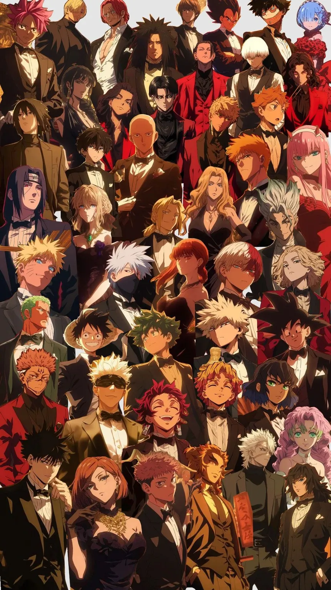
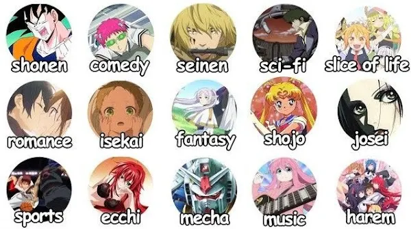
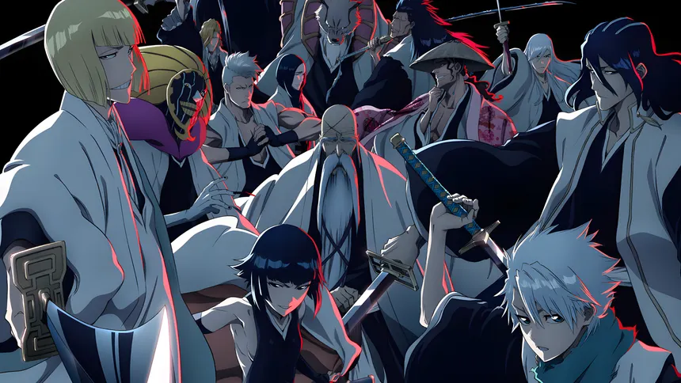
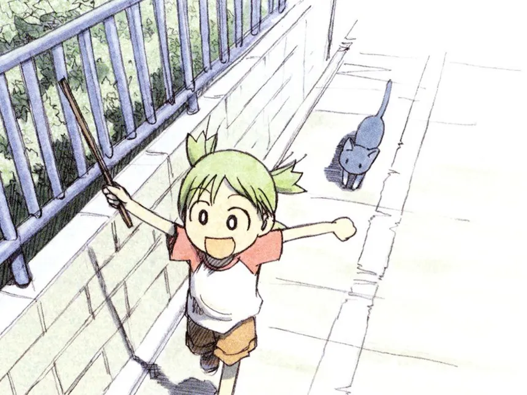
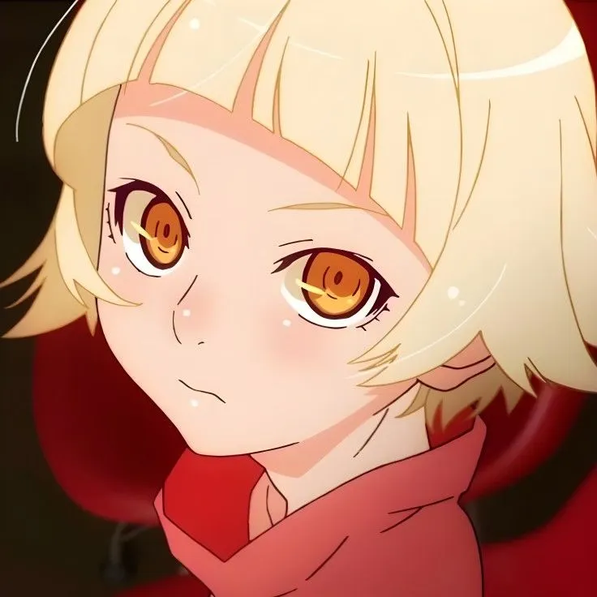
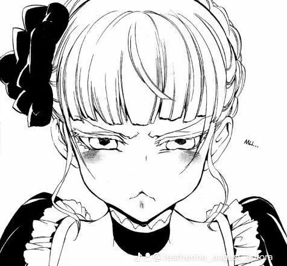

# What Is Manga And What Is Anime?

*Written on 21.10.2025*

Manga and anime are terms that are regularly covered in the current pop culture. I have always been a great fan of anime and since my teenage years, I have been more into mangas than animes. I have tried hundreds of series from each media (rookie numbers, I know haha). They have marked my life greatly, influencing how I think and who I am now.

This article aims to define the two media and possibly introduce you to my tastes and ways to get into these forms of entertainment.
Before starting with the history and current state of the two media, I would like to firstly define both.

---

## Definition

Manga refers to Japanese comic books or graphic novels. They are typically black-and-white, serialised in magazines and cover a wide variety of genres, ranging from cute patootie magic girls to seinen content playing with legal content limits. Manga is read in right-to-left format, which is traditional in Japan.

Anime is Japanese animation comprising of TV shows,films and web series. Similarly to mangas, it covers a broad plethora of genres and target audiences. Anime are most often adaptations of manga, light novels, video games or original works due to their more demanding and costly nature to produce.

Anime is considered more mainstream than manga and constitutes an easier entry point into the anime-manga universe.

---

## Origins: Modern History Mainly

### Origins of Manga
Storytelling in the form of drawn works with some influence from Western comics emerged in the late 19th-early 20th century in Japan. Past the Post-WWII boom, Osamu Tezuka (a.k.a the "God Of Manga") revolutionised manga in the 1940s to 50s with cinematic storytelling. He is well known for his work "Atom, 1952". 

Decades later in the 1970s, manga diversified into more specific genres shōnen (boys), shōjo (girls), seinen (adult men), and josei (adult women). Those are loose categories that classify the works in terms of their target audiences. Those helped create boundaries between the genres, even though many works (e.g. Code Geass, XXXHolic, arguably One Piece, etc.).

### Origins of Anime
Anime has its origins in Japan's first animated films in the 1910s to 1920s. Those were short experimental works and anime was only ever born officially in the 60s when Japan's first popular TV anime series was released: Astro Boy (1963) following Osamu Tezuka's influence.

Anime would only grow more mainstream with titles such as Akira, Dragon Ball, Sailor Moon, Naruto, and recently enough Demon Slayer. These classics in the world of anime helped anime gain popularity outside of the Japanese culture sphere.

---

## Current State Of Manga And Anime

### Manga Today

- Manga is a multi-billion-dollar industry, with physical and digital formats thriving.

- Popular platforms include Shueisha’s Shonen Jump, Kodansha Comics, and VIZ Media for English translations.

- Genres are extremely diverse, and manga often crosses over into anime, live-action films, and merchandise.

### Anime Today
- Anime production has global visibility, thanks to streaming services like Crunchyroll, Netflix, Disney+, and Funimation.

- Popular series now attract worldwide fandoms, cosplay communities, and conventions.

- High-quality animation, diverse storytelling, and hybrid production techniques (2D + 3D CGI) are becoming standard.

---

## My History with Manga And Amime

As mentioned earlier, I have known the world of mangas and animes for a long time now. In fact, I have been watching animes since my childhood. It started with Hokuto No Ken, Fullmetal Alchemist Brotherhood, Dragonball Z, One Piece and Naruto with my dad. My dad who discovered the new media in his teenage years introduced me very early to this world.

Mangas and animes allowed me to explore different perspectives and worlds that were not usually represented in Western cartoons. Strangely, as a kid, I would be allowed to watch Hokuto No Ken, Cobra and Nicky Larson (City Hunter) and not 12 rated shows (Hokuto No Ken and Fullmetal Alchemist Brotherhood is arguably worse in terms of portrayal of violence or the things portrayed). From the age of 6 to 14, I would watch classics of the 90s and 2000s with my dad, enjoying the episodes that we would often obtain in interesting ways *wink, wink*. Moreover, the broadcasting service Parabole Reunion that we had or even the one offered under Kanal+ or Orange (back then in Mauritius) had animes or Japanese-adjacent shows.

I would watch classics such as the ones previously mentioned and more: Ranma 1/2, Soul Eater, Death Note amongst others. Past these first few years of content, I would then discover mangas (which were totally unknown to me back then) when I could use my dad's PC. In fact, mangas came way later into my life than animes, but my enjoyment of mangas stayed much longer than animes and are till now more appealing as a media than anime. With a PC and the new wave of "streaming" websites for animes and mangas, I would spam the two media in my free time after highschool.

I was a huge nerd when I look back at these times: not staying to play football or hang out with friends (I was broke, just enough money for 1 snack per day in highschool or YuGiOh cards), and instead rushing home on the school bus to watch anime for 3 hrs. I would forget homeworks (I was literally learning all my English off of animes and YouTube videos) and just stream animes. Relatively speaking, I was not a big consumer of animes. I would later learn that friends would catch up to One Piece in a matter of weeks only after energy drink fueled anime sessions.

On my own, I discovered anime gems such as the Bakemonogatari series (which I still haven't fully completed), Shinsekai Yori (hidden gem), The Melancholy of Haruhi Suzumiya, Yotsuba&!, XXXHolic, Aria, Higurashi: When They Cry, Angel Beats (really cried on that one), Toradora!, Beck, Black Lagoon, and many others. During this time, my liking of chibis and cutesy tingies came. I just like the really stylised art of animes and mangas, and cannot appreciate the realism that is portrayed in Western cartoon classics. As a sneak-peek to what I will be addressing in another article, I am a huge fan of seinens and have dabbled in shōjos and joseis. Given that I am a guy, shōnen animes/mangas have always been present in my animelist.

Recently, I've delved into mostly seinen animes: Umineko, Owarimonogatari, Koyomimonogatari, and Orb: On the Movements of the Earth (which was graciously recommended to me by a friend) and an shōnen show known as "Fable" (it comes with this amazing opening: [ALI - Professionalism feat. Hannya](https://youtu.be/Wbil2azbSWs?si=aQ322tKTjN6fW_ID))

Above is Beatrice, a "bloodthirsty" witch who aims to gruesomly murder everyone trapped on an island in a twisted mystery/thriller anime/manga. Even such villains can be cutified.

---

## Resources I Would Recommend

- [https://myanimelist.net/](https://myanimelist.net/) has all kinds of rankings and suggestions for anime/manga. It is my go-to when I want to reliably know what anime/manga will suit my tastes.
- Even though I do not really endorse the politics of Wikis, they are an invaluable tool to fans. Use these unless there is a dedicated fanbase-run website other than wikis. For instance, here is the One Piece wiki [https://onepiece.fandom.com/wiki/One_Piece_Wiki](https://onepiece.fandom.com/wiki/One_Piece_Wiki). These hold valuable information about many hidden aspects and meanings of the anime/manga.
- [https://www.anime-planet.com/](https://www.anime-planet.com/) is less popular than MyAnimeList, but is reliable as well.

--- 

## Comments Section

