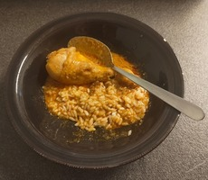

# Thai Red Curry

*Published: October 18, 2025*

I decided to have a try at cooking some Thai red curry today. Using some curry paste and chicken I had bought previously,
I followed the recipe below and prepped some 1200 g of chicken.
The recipe called for 1200 ml+  of coconut milk which I didn't have, so I substituted it with some milk and chicken broth (horrendous, I know).

Thai Red Curry Recipe at: [https://www.recipetineats.com/thai-red-curry-with-chicken/](https://www.recipetineats.com/thai-red-curry-with-chicken/)

Below is a picture of the Thai red curry with some leftover rice I made.

---

## Comments Section

